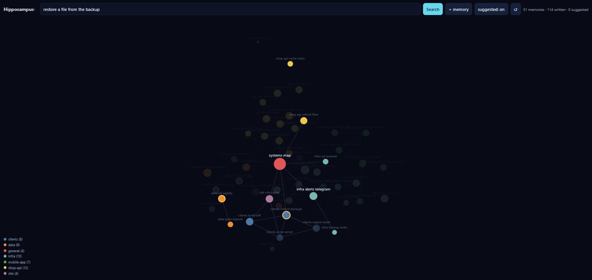
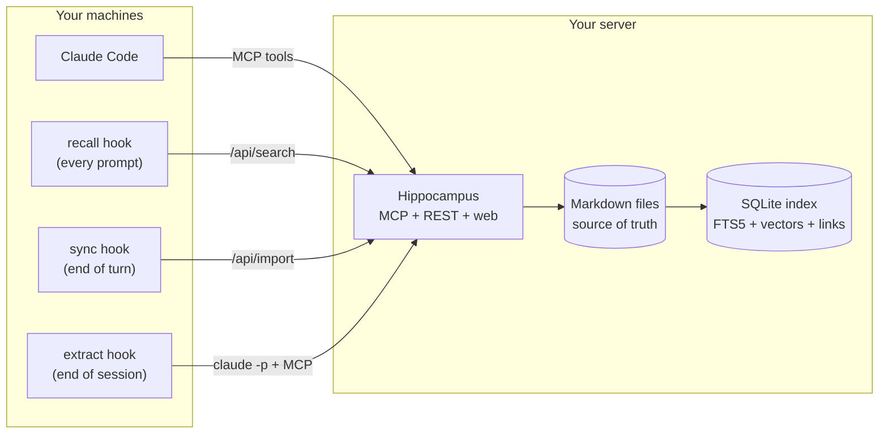
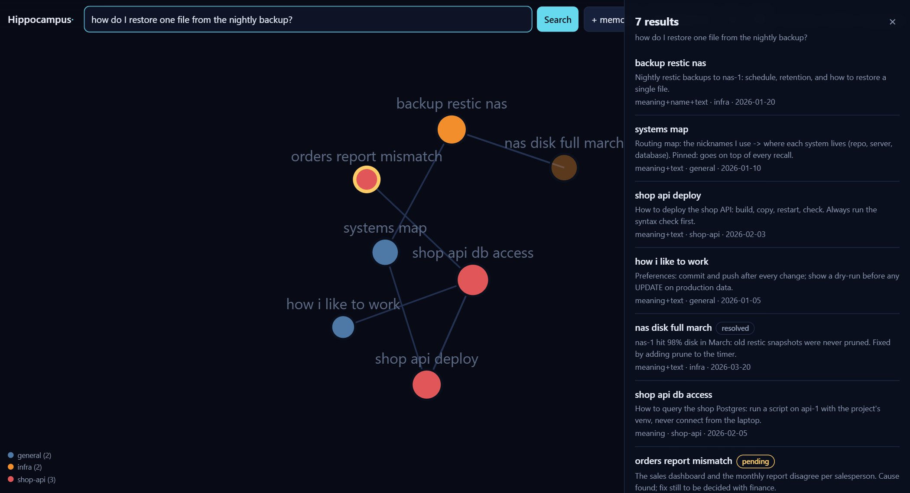
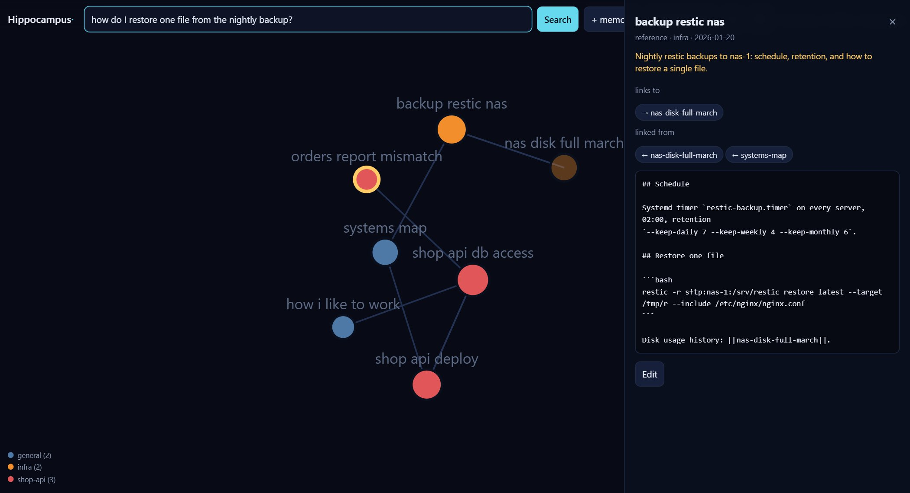

<div align="center">

# Hippocampus

**Self-hosted, persistent long-term memory for Claude Code and other MCP clients.**
One memory server shared by every session, every project and every machine.

[](https://github.com/marcelinollima/hippocampus/actions/workflows/ci.yml)
[](https://github.com/marcelinollima/hippocampus/releases)
[](LICENSE)


English · [Português](README.pt-BR.md)

</div>

---

Hippocampus is an **MCP memory server** you run yourself. It stores memories
as plain Markdown files, indexes them in SQLite, and finds them with **hybrid
search: BM25 keywords + vector embeddings + a knowledge graph** of links that
you (or Claude) write between notes. Claude Code hooks recall relevant
memories on every prompt and curate the memory at the end of each session.



## Why Hippocampus?

Claude Code keeps memory **per project folder**. Open a session in another
folder, or on another machine, and everything learned elsewhere is gone:
which server runs what, how to reach the production database without being
blocked, what was already fixed last week. You end up explaining the same
things over and over, and Claude keeps retrying approaches that already failed.

Hippocampus moves those memories to **one memory server you own**, on your own
computer or on a small VPS, and wires it into Claude Code, so that every session:

- **recalls automatically.** A hook searches memory on every prompt and
  injects the few notes that matter, before Claude starts working.
- **writes to the shared memory.** Claude gets MCP tools to search, read, save
  and update memories, and they are visible everywhere at once.
- **tracks what is still open.** Each memory has a status
  (`active · pending · resolved · superseded`), so "what's still pending?" has
  a real answer, and resolved items stop showing up as open.
- **curates itself.** At the end of a session an optional hook reviews the
  transcript, closes pending items that got done and saves new durable facts.

Memories are **plain Markdown files**. The database is only an index you can
delete and rebuild at any time. Embeddings run **locally** (ONNX): no API key
is needed and your notes never go to a third party.

## Example: what Claude receives

Claude calls `search_memory("restic backup on nas-1 is failing, disk full?")`
and gets this back (real output from the [sample memories](examples/memories),
trimmed):

```text
# Relevant memories for: restic backup on nas-1 is failing, disk full?

## backup-restic-nas  (reference | project infra | 2026-01-20 | via meaning+name+text)
_Nightly restic backups to nas-1: schedule, retention, and how to restore a single file._
...
Disk usage history: [[nas-disk-full-march]].

## nas-disk-full-march  (project | project infra | 2026-03-20 | RESOLVED on 2026-03-21 | via graph neighbour)
_nas-1 hit 98% disk in March: old restic snapshots were never pruned. Fixed by adding prune to the timer._
...

> Old facts may be stale: check the date before acting on them.
```

The first note was found by keywords **and** meaning. The second came in
through the `[[nas-disk-full-march]]` link written in the first one, and it is
labelled as a resolved incident, so Claude treats it as history, not as the
current state. The recall hook injects the same kind of block on every prompt,
in a lighter form (fewer results, no link expansion) because it is paid on
every message.

Other things you can say in any session, on any machine:

- *"What's still pending on the shop API?"* → `list_pending`
- *"Save to memory how we fixed the orders report."* → `save_memory`
- *"The disk issue is fixed, mark it resolved."* → `mark_memory`

## How it works



A search mixes three signals:

1. **BM25** (SQLite FTS5) for exact names, ports, flags and numbers;
2. **vectors** (`paraphrase-multilingual-MiniLM-L12-v2`, 384 dims, per section
   rather than per file) for meaning, in 50+ languages;
3. **the link graph**: each `[[other-memory]]` a human or Claude wrote adds a
   one-hop expansion that similarity search cannot infer.

The first two are fused with Reciprocal Rank Fusion. Resolved and superseded
memories are demoted but still findable. The reasoning behind each choice is in
[docs/design.md](docs/design.md).

### How this differs from a vector-database memory

A memory that is only "embed every note, return the nearest vectors" misses
several things that matter for an agent working on real systems:

| | vectors only | Hippocampus |
|---|---|---|
| Exact tokens (`5432`, `--force`, a hostname) | often lost in the embedding | BM25 (FTS5) ranks them directly |
| Long notes | one vector per note blurs its topics | one vector per `##` section |
| "This depends on that" | cannot be inferred from similarity | hand-written `[[links]]` expand results one hop |
| Outdated facts | returned as if still true | `resolved` / `superseded` demoted and labelled with a date |
| Open work | not modelled | `pending` status and `list_pending` |
| Storage | opaque database | Markdown files; the index can be rebuilt with `hippocampus sync --full` |
| Embeddings | often a hosted API | local ONNX model, no API key |

## Screenshots

| Search results with the signals behind each hit | A memory with its links in and out |
|---|---|
|  |  |

The web UI shows the whole memory as a **constellation**, which you can search,
open, edit and filter by project.

## Quick start

### 1. Choose where it runs

| | **On your computer** | **On a server (VPS)** |
|---|---|---|
| Good for | one machine, trying it out | several machines, phone, claude.ai |
| You need | Python 3.10+ | a small VPS (1 GB RAM + 2 GB swap) and a domain |
| Memory reachable from | this computer only | everywhere you use Claude |
| Setup | ~5 minutes | ~15 minutes |

You can start local and move to a server later: memories are plain files, so
you just copy the `memories` folder.

### 2a. On your computer

```bash
git clone https://github.com/marcelinollima/hippocampus && cd hippocampus
pip install .
hippocampus init        # creates ~/.hippocampus with a data folder and a token
hippocampus autostart   # starts the server now and at every login (no terminal to keep open)
python clients/claude-code/install.py --url http://127.0.0.1:8765
```

That's all: open a new Claude Code session. The web UI is at
<http://127.0.0.1:8765>, and it asks for the token saved in
`~/.hippocampus/server-token`. To load the sample memories, copy
`examples/memories/*` into `~/.hippocampus/data/memories/`.

`autostart` uses the Startup folder on Windows, a LaunchAgent on macOS and a
systemd user unit on Linux. None of them needs admin rights, and
`hippocampus autostart --remove` undoes it. If you prefer Docker, use
`docker compose -f docker-compose.local.yml up -d` (instructions are at the top
of that file).

### 2b. On a server

```bash
git clone https://github.com/marcelinollima/hippocampus && cd hippocampus
cp .env.example .env         # set DOMAIN and HIPPOCAMPUS_TOKEN
mkdir -p data                # memories + index live here (back it up)
docker compose up -d         # Hippocampus + Caddy with automatic HTTPS
```

If you don't use Docker, see [deploy/systemd](deploy/systemd/hippocampus.service).
Then, on every machine where you use Claude Code:

```bash
python clients/claude-code/install.py --url https://memory.example.com --token <TOKEN>
```

The installer registers the MCP server (user scope) and the three hooks. It
backs up `~/.claude/settings.json` first, and `--uninstall` reverses
everything. Your existing Claude Code memory folders
(`~/.claude/projects/*/memory`) are uploaded on the next sync.

To use the same memory from claude.ai (web, desktop and mobile), see
[docs/claude-ai.md](docs/claude-ai.md).

### 3. Use it

Nothing changes in how you work. Ask Claude something about your
infrastructure and look for the `<long-term-memory>` block it received. To
teach it something, say *"save this to memory"*.

## MCP memory tools

The server speaks MCP over streamable HTTP, so any MCP client that supports it
can use these tools. The automatic recall, sync and curation hooks are
specific to Claude Code.

| tool | what it does |
|---|---|
| `search_memory(query, limit)` | hybrid search; returns a context block ready to use |
| `read_memory(name)` | the full memory, with its links in and out and similar memories |
| `save_memory(name, description, body, type, project, status)` | create or update |
| `mark_memory(name, status, note)` | change the status and append a dated note |
| `list_pending(project)` | what is still open |
| `list_memories(project)` | browse by project |

## Memory format

The format is the one Claude Code already uses for its own memory files, so
existing notes work as they are:

```markdown
---
name: shop-api-deploy
description: "How to deploy the shop API: build, copy, restart, check."
metadata:
  type: reference          # project | reference | feedback | user
  status: active           # active | pending | resolved | superseded
---

## Steps
1. `python -m compileall src` first: one SyntaxError takes down every route.
...
Related: [[shop-api-db-access]]
```

Folder = project: `data/memories/<project>/<name>.md`. You can edit files on
disk and run `hippocampus sync`, or use the web UI, or let Claude do it.

## Configuration

All server settings are environment variables. [.env.example](.env.example)
documents each of them. The most useful ones:

| variable | purpose |
|---|---|
| `HIPPOCAMPUS_TOKEN` | bearer token for MCP, API and web UI (**required**) |
| `HIPPOCAMPUS_OWNER` | your name, used in the instructions Claude receives |
| `HIPPOCAMPUS_LANG` | `en` (default) or `pt`: language of the MCP instructions and of what the server writes into Claude's context |
| `HIPPOCAMPUS_PINNED` | a memory injected on top of **every** recall, e.g. a map of "nickname → repo, server, database" |
| `HIPPOCAMPUS_URL_SECRET` | enables `/mcp/<secret>` for clients that can't send headers, such as claude.ai custom connectors ([guide](docs/claude-ai.md)) |
| `HIPPOCAMPUS_MODEL` | any [fastembed](https://qdrant.github.io/fastembed/examples/Supported_Models/) text model |

The client side lives in `~/.hippocampus/client.json`, which is written by
the installer. There you can map local project folders to server projects,
add extra memory folders, or turn off automatic extraction. Install with
`--lang pt` to get the recall header and the automatically extracted
memories in Portuguese. The web UI follows your browser's language and has
an EN/PT button to switch.

## Security

Memories tend to contain exactly what an attacker wants: hostnames, database
names and access recipes. Hippocampus is built around that:

- one bearer token, compared in constant time, on every route except `/` and `/health`;
- the app listens on `127.0.0.1` only, behind a TLS proxy (Caddy);
- DNS-rebinding protection on `/mcp` (explicit list of allowed hosts);
- recalled memories are labelled as **notes, not instructions**, and the
  extraction prompt treats the transcript as evidence only.

Read [SECURITY.md](SECURITY.md) before exposing a server, and never commit
your `data/` folder.

## CLI

```
hippocampus init                  # prepare a local install (~/.hippocampus + token)
hippocampus autostart [--remove]  # run the server at every login (Windows, macOS, Linux)
hippocampus serve                 # MCP + API + web (syncs on start)
hippocampus sync [--full]         # index new/changed files, or rebuild everything
hippocampus suggest-links         # compute "similar" edges for the constellation
hippocampus stats                 # counts, broken links, pending items
hippocampus token                 # generate a random token
```

## Project status

Hippocampus came out of its author's daily work, where it holds 360+
memories across 9 projects. It is young (0.x): expect rough edges and please
report them. CI runs the tests on Linux and Windows, a Docker smoke test, a
secret scan, and the full local install on Windows and macOS.

Known limitations:

- one token per server: it is a personal memory, not a multi-user one;
- automatic recall and curation hooks exist for Claude Code only; other MCP
  clients get the tools but must call them themselves;
- link expansion is one hop, over hand-written links only (by design, see
  [docs/design.md](docs/design.md)).

Bug reports and ideas are welcome in the
[issues](https://github.com/marcelinollima/hippocampus/issues), and
contributions in English or Portuguese. See [CONTRIBUTING.md](CONTRIBUTING.md).
Changes are listed in the [CHANGELOG](CHANGELOG.md).

## License

[MIT](LICENSE)
