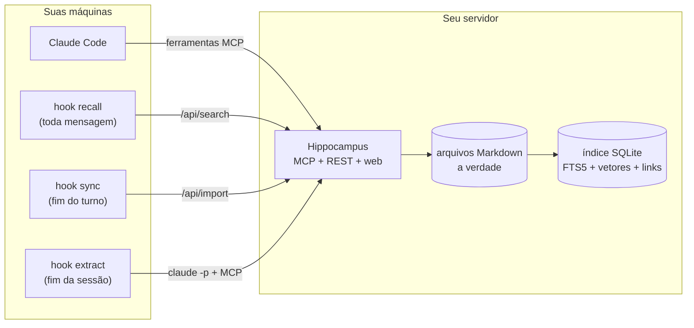

<div align="center">

# Hippocampus

**Memória persistente de longo prazo, no seu próprio servidor, para o Claude Code e outros clientes MCP.**
Um servidor de memória só, compartilhado por todas as sessões, todos os projetos e todas as máquinas.

[](https://github.com/marcelinollima/hippocampus/actions/workflows/ci.yml)
[](https://github.com/marcelinollima/hippocampus/releases)
[](LICENSE)


[English](README.md) · Português

</div>

---

O Hippocampus é um **servidor de memória MCP** que você mesmo roda. Ele guarda
as memórias como arquivos Markdown comuns, indexa tudo em SQLite e encontra o
que importa com **busca híbrida: palavras-chave BM25 + embeddings vetoriais +
um grafo de conhecimento** feito das ligações que você (ou o Claude) escreve
entre as notas. Hooks do Claude Code trazem as memórias certas a cada mensagem
e organizam a memória no fim de cada sessão.


## Por que o Hippocampus?

O Claude Code guarda memória **por pasta de projeto**. Abriu a sessão em outra
pasta, ou em outra máquina, e tudo que ele aprendeu no outro lugar some: qual
servidor roda o quê, como acessar o banco de produção sem ser bloqueado, o que
já foi resolvido semana passada. Você acaba explicando as mesmas coisas de
novo, e ele volta a tentar caminhos que já falharam.

O Hippocampus leva essas memórias para **um servidor de memória seu**, no seu próprio
computador ou numa VPS pequena, e liga isso no Claude Code. Assim, toda sessão:

- **lembra sozinha.** Um hook busca na memória a cada mensagem e injeta as
  poucas notas que importam antes de o Claude começar a trabalhar.
- **grava na memória compartilhada.** O Claude ganha ferramentas MCP para
  buscar, ler, salvar e atualizar memórias, que ficam visíveis em todo lugar
  na hora.
- **sabe o que ainda está aberto.** Cada memória tem um status
  (`active · pending · resolved · superseded`). A pergunta "o que está
  pendente?" passa a ter resposta de verdade, e o que já foi resolvido deixa de
  aparecer como aberto.
- **se organiza sozinha.** No fim da sessão, um hook opcional revisa a
  conversa, fecha as pendências que foram concluídas e grava os fatos novos que
  valem guardar.

As memórias são **arquivos Markdown comuns**. O banco é só um índice, que dá
pra apagar e reconstruir quando quiser. Os embeddings rodam **localmente**
(ONNX): não precisa de chave de API e suas notas não vão para terceiros.

## Exemplo: o que o Claude recebe

O Claude chama `search_memory("restic backup on nas-1 is failing, disk full?")`
e recebe isto de volta (saída real das [memórias de exemplo](examples/memories),
que estão em inglês, resumida):

```text
# Relevant memories for: restic backup on nas-1 is failing, disk full?

## backup-restic-nas  (reference | project infra | 2026-01-20 | via meaning+name+text)
_Nightly restic backups to nas-1: schedule, retention, and how to restore a single file._
...
Disk usage history: [[nas-disk-full-march]].

## nas-disk-full-march  (project | project infra | 2026-03-20 | RESOLVED on 2026-03-21 | via graph neighbour)
_nas-1 hit 98% disk in March: old restic snapshots were never pruned. Fixed by adding prune to the timer._
...

> Old facts may be stale: check the date before acting on them.
```

A primeira nota foi achada por palavra-chave **e** por sentido. A segunda veio
pela ligação `[[nas-disk-full-march]]` escrita na primeira, e chega marcada
como incidente resolvido, então o Claude a trata como histórico, não como o
estado atual. O hook de busca automática injeta o mesmo tipo de bloco a cada
mensagem, numa versão mais leve (menos resultados, sem expansão por ligações),
porque ele é pago em toda mensagem. Com `HIPPOCAMPUS_LANG=pt` o cabeçalho sai
em português.

Outras coisas que você pode dizer em qualquer sessão, em qualquer máquina:

- *"O que ainda está pendente na API da loja?"* → `list_pending`
- *"Salva na memória como a gente corrigiu o relatório de pedidos."* → `save_memory`
- *"O problema do disco foi resolvido, marca como resolvido."* → `mark_memory`

## Como funciona



A busca mistura três sinais:

1. **BM25** (SQLite FTS5), que acha nome próprio, porta, flag e número exatos;
2. **vetores** (`paraphrase-multilingual-MiniLM-L12-v2`, 384 dimensões, um por
   seção em vez de um por arquivo), que acham pelo sentido, em mais de 50
   idiomas. Uma pergunta em português encontra uma nota em inglês;
3. **o grafo de ligações**: cada `[[outra-memoria]]` escrito à mão vira uma
   expansão de um salto, coisa que a busca por semelhança não consegue deduzir.

Os dois primeiros são combinados com Reciprocal Rank Fusion. Memórias
resolvidas ou substituídas perdem prioridade, mas continuam aparecendo na
busca. O porquê de cada escolha está em [docs/design.md](docs/design.md) (em
inglês).

### O que muda em relação a uma memória só com banco vetorial

Uma memória que só "gera o embedding de cada nota e devolve os vetores mais
próximos" deixa escapar coisas que importam para um agente trabalhando em
sistemas reais:

| | só vetores | Hippocampus |
|---|---|---|
| Termos exatos (`5432`, `--force`, um hostname) | costumam se perder no embedding | o BM25 (FTS5) ranqueia direto |
| Notas longas | um vetor por nota mistura os assuntos | um vetor por seção `##` |
| "Isto depende daquilo" | não sai da semelhança | ligações `[[...]]` escritas à mão expandem um salto |
| Fatos antigos | voltam como se ainda valessem | `resolved` / `superseded` perdem prioridade e vêm com data |
| Trabalho em aberto | não existe | status `pending` e `list_pending` |
| Armazenamento | banco opaco | arquivos Markdown; o índice se reconstrói com `hippocampus sync --full` |
| Embeddings | muitas vezes uma API externa | modelo ONNX local, sem chave de API |

## Telas

| Resultados da busca, com o sinal que achou cada um | Uma memória com as ligações de entrada e saída |
|---|---|
|  |  |

A interface web mostra a memória inteira como uma **constelação**, onde dá pra
buscar, abrir, editar e filtrar por projeto. Ela abre em português quando o
navegador está em português.

## Começando

### 1. Escolha onde ele roda

| | **No seu computador** | **Num servidor (VPS)** |
|---|---|---|
| Bom para | uma máquina só, experimentar | vários computadores, celular, claude.ai |
| Você precisa de | Python 3.10+ | uma VPS pequena (1 GB de RAM + 2 GB de swap) e um domínio |
| A memória fica acessível | só neste computador | em qualquer lugar onde você usa o Claude |
| Instalação | ~5 minutos | ~15 minutos |

Dá pra começar no computador e passar pra um servidor depois. As memórias são
arquivos comuns, então basta copiar a pasta `memories`.

### 2a. No seu computador

```bash
git clone https://github.com/marcelinollima/hippocampus && cd hippocampus
pip install .
hippocampus init        # cria ~/.hippocampus com a pasta de dados e um token
hippocampus autostart   # liga o servidor agora e a cada login (sem terminal aberto)
python clients/claude-code/install.py --url http://127.0.0.1:8765 --lang pt
```

Pronto: abra uma sessão nova do Claude Code. A interface web fica em
<http://127.0.0.1:8765> e pede o token salvo em `~/.hippocampus/server-token`.
Para carregar as memórias de exemplo, copie `examples/memories/*` para
`~/.hippocampus/data/memories/`.

O `autostart` usa a pasta Inicializar no Windows, um LaunchAgent no macOS e um
serviço systemd de usuário no Linux. Nenhum deles precisa de administrador, e
`hippocampus autostart --remove` desfaz. Se preferir Docker, use
`docker compose -f docker-compose.local.yml up -d` (as instruções estão no
começo do arquivo).

### 2b. Num servidor

```bash
git clone https://github.com/marcelinollima/hippocampus && cd hippocampus
cp .env.example .env         # preencha DOMAIN e HIPPOCAMPUS_TOKEN
mkdir -p data                # memórias + índice ficam aqui (faça backup)
docker compose up -d         # Hippocampus + Caddy com HTTPS automático
```

Sem Docker, veja [deploy/systemd](deploy/systemd/hippocampus.service). Depois,
em cada máquina onde você usa o Claude Code:

```bash
python clients/claude-code/install.py --url https://memoria.exemplo.com.br --token <TOKEN> --lang pt
```

O instalador registra o servidor MCP (escopo de usuário) e os três hooks.
Antes de mexer, ele faz backup do `~/.claude/settings.json`, e `--uninstall`
desfaz tudo. As pastas de memória que o Claude Code já tem
(`~/.claude/projects/*/memory`) sobem no próximo sync.

Para usar a mesma memória no claude.ai (web, desktop e celular), veja
[docs/claude-ai.md](docs/claude-ai.md).

### 3. Use

Nada muda no seu jeito de trabalhar. Pergunte ao Claude algo da sua
infraestrutura e repare no bloco `<long-term-memory>` que ele recebeu. Para
ensinar algo, diga *"salva isso na memória"*.

## Ferramentas de memória MCP

O servidor fala MCP por streamable HTTP, então qualquer cliente MCP que
suporte esse transporte pode usar estas ferramentas. Os hooks de busca
automática, sync e organização são específicos do Claude Code.

| ferramenta | o que faz |
|---|---|
| `search_memory(query, limit)` | busca híbrida; devolve um bloco de contexto pronto |
| `read_memory(name)` | a memória inteira, com quem ela cita, quem cita ela e as parecidas |
| `save_memory(name, description, body, type, project, status)` | cria ou atualiza |
| `mark_memory(name, status, note)` | muda o status e anexa uma nota com data |
| `list_pending(project)` | o que ainda está aberto |
| `list_memories(project)` | navega por projeto |

## Formato da memória

É o mesmo formato que o Claude Code já usa nos arquivos de memória dele, então
as notas que você já tem funcionam como estão. Status em português (`ativa`,
`pendente`, `resolvida`, `substituida`) também é aceito.

```markdown
---
name: deploy-api-loja
description: "Como fazer deploy da API da loja: build, cópia, restart, conferência."
metadata:
  type: reference          # project | reference | feedback | user
  status: active           # active | pending | resolved | superseded
---

## Passos
1. `python -m compileall src` antes: um SyntaxError derruba todas as rotas.
...
Relacionado: [[acesso-banco-loja]]
```

Pasta = projeto: `data/memories/<projeto>/<nome>.md`. Dá pra editar os arquivos
direto no disco e rodar `hippocampus sync`, usar a interface web ou deixar o
Claude fazer isso.

## Configuração

Toda a configuração do servidor é feita por variáveis de ambiente. O
[.env.example](.env.example) explica cada uma. As mais úteis:

| variável | para que serve |
|---|---|
| `HIPPOCAMPUS_TOKEN` | token de acesso do MCP, da API e da web (**obrigatório**) |
| `HIPPOCAMPUS_OWNER` | seu nome, usado nas instruções que o Claude recebe |
| `HIPPOCAMPUS_LANG` | `en` (padrão) ou `pt`: idioma das instruções do MCP e do que o servidor escreve no contexto do Claude |
| `HIPPOCAMPUS_PINNED` | uma memória que vai no topo de **toda** busca automática, por exemplo um mapa "apelido → repo, servidor, banco" |
| `HIPPOCAMPUS_URL_SECRET` | habilita `/mcp/<segredo>` para clientes que não mandam cabeçalho, como os conectores personalizados do claude.ai ([guia](docs/claude-ai.md)) |
| `HIPPOCAMPUS_MODEL` | qualquer modelo de texto do [fastembed](https://qdrant.github.io/fastembed/examples/Supported_Models/) |

O lado do cliente fica em `~/.hippocampus/client.json`, que é criado pelo
instalador. Lá dá pra mapear pastas locais para projetos do servidor,
adicionar outras pastas de memória ou desligar a extração automática. Instale
com `--lang pt` para receber em português o cabeçalho da busca automática e
as memórias extraídas no fim da sessão. A interface web segue o idioma do
navegador e tem um botão EN/PT para trocar.

## Segurança

Memória costuma ter exatamente o que um atacante quer: nome de servidor, de
banco e o caminho de acesso. O Hippocampus foi feito pensando nisso:

- um token, comparado em tempo constante, em toda rota menos `/` e `/health`;
- o app escuta só em `127.0.0.1`, atrás de um proxy com TLS (Caddy);
- proteção contra DNS rebinding no `/mcp` (lista explícita de hosts aceitos);
- as memórias recuperadas chegam marcadas como **notas, não instruções**, e o
  prompt de extração trata a conversa só como evidência.

Leia o [SECURITY.md](SECURITY.md) antes de expor um servidor, e nunca faça
commit da pasta `data/`.

## Linha de comando

```
hippocampus init                  # prepara uma instalação local (~/.hippocampus + token)
hippocampus autostart [--remove]  # liga o servidor a cada login (Windows, macOS, Linux)
hippocampus serve                 # MCP + API + web (sincroniza ao subir)
hippocampus sync [--full]         # indexa o que é novo/mudou, ou reconstrói tudo
hippocampus suggest-links         # calcula as ligações "parecidas" da constelação
hippocampus stats                 # contagens, links quebrados, pendências
hippocampus token                 # gera um token aleatório
```

## Estado do projeto

O Hippocampus nasceu do trabalho diário do autor, onde guarda mais de 360
memórias em 9 projetos. É um projeto novo (0.x), então espere arestas e, por
favor, reporte o que achar. O CI roda os testes em Linux e Windows, um teste
do Docker, uma varredura de segredos e a instalação local completa em Windows
e macOS.

Limitações conhecidas:

- um token por servidor: é uma memória pessoal, não multiusuário;
- os hooks de busca automática e organização existem só para o Claude Code;
  outros clientes MCP recebem as ferramentas, mas precisam chamá-las por conta
  própria;
- a expansão por ligações é de um salto, só pelas ligações escritas à mão (de
  propósito, veja [docs/design.md](docs/design.md)).

Ideias e problemas vão nas
[issues](https://github.com/marcelinollima/hippocampus/issues). Contribuições
são bem-vindas, e issues em português também. Veja o
[CONTRIBUTING.md](CONTRIBUTING.md). As mudanças estão no
[CHANGELOG](CHANGELOG.md).

## Licença

[MIT](LICENSE)
