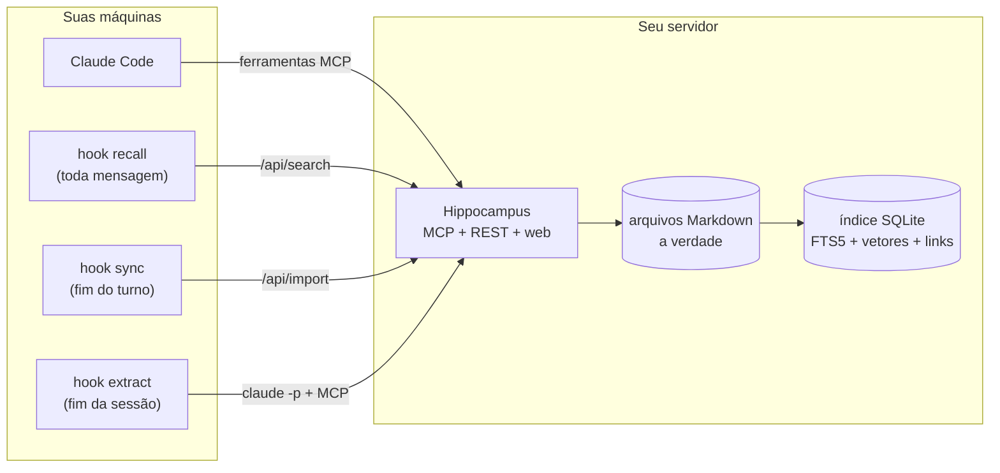

<div align="center">

# Hippocampus

**Memória de longo prazo, no seu próprio servidor, para o Claude Code.**
Uma memória só, compartilhada por todas as sessões, todos os projetos e todas as máquinas.

[](https://github.com/marcelinollima/hippocampus/actions/workflows/ci.yml)
[](LICENSE)


[English](README.md) · Português

</div>

---

## O problema

O Claude Code guarda memória **por pasta de projeto**. Abriu a sessão em outra
pasta, ou em outra máquina, e tudo que ele aprendeu no outro lugar some: qual
servidor roda o quê, como acessar o banco de produção sem ser bloqueado, o que
já foi resolvido semana passada. Você acaba explicando as mesmas coisas de
novo, e ele volta a tentar caminhos que já falharam.

## O que o Hippocampus faz

Ele leva essas memórias para **um servidorzinho seu** e liga isso no Claude
Code. Assim, toda sessão:

- **lembra sozinha.** Um hook busca na memória a cada mensagem e injeta as
  poucas notas que importam antes de o Claude começar a trabalhar.
- **grava na memória compartilhada.** O Claude ganha ferramentas MCP para
  buscar, ler, salvar e atualizar memórias, que ficam visíveis em todo lugar
  na hora.
- **sabe o que ainda está aberto.** Cada memória tem um status
  (`active · pending · resolved · superseded`). A pergunta "o que está
  pendente?" passa a ter resposta de verdade, e o que já foi resolvido deixa de
  aparecer como aberto.
- **se organiza sozinha.** No fim da sessão, um hook opcional revisa a
  conversa, fecha as pendências que foram concluídas e grava os fatos novos que
  valem guardar.

As memórias são **arquivos Markdown comuns**. O banco é só um índice, que dá
pra apagar e reconstruir quando quiser. Os embeddings rodam **localmente**
(ONNX): não precisa de chave de API e suas notas não vão para terceiros.


## Como funciona



A busca mistura três sinais:

1. **BM25** (SQLite FTS5), que acha nome próprio, porta, flag e número exatos;
2. **vetores** (`paraphrase-multilingual-MiniLM-L12-v2`, 384 dimensões, um por
   seção em vez de um por arquivo), que acham pelo sentido, em mais de 50
   idiomas. Uma pergunta em português encontra uma nota em inglês;
3. **o grafo de ligações**: cada `[[outra-memoria]]` escrito à mão vira uma
   expansão de um salto, coisa que a busca por semelhança não consegue deduzir.

Os dois primeiros são combinados com Reciprocal Rank Fusion. Memórias
resolvidas ou substituídas perdem prioridade, mas continuam aparecendo na
busca. O porquê de cada escolha está em [docs/design.md](docs/design.md) (em
inglês).

A interface web mostra a memória inteira como uma **constelação**, onde dá pra
buscar, abrir, editar e filtrar por projeto. Ela abre em português quando o
navegador está em português.

## Começando

### 1. Suba o servidor

Você precisa de uma máquina com um domínio público. Uma VPS de 1 GB de RAM com
2 GB de swap já basta.

```bash
git clone https://github.com/marcelinollima/hippocampus && cd hippocampus
cp .env.example .env         # preencha DOMAIN e HIPPOCAMPUS_TOKEN
mkdir -p data                # memórias + índice ficam aqui (faça backup)
docker compose up -d         # Hippocampus + Caddy com HTTPS automático
```

Sem Docker, veja [deploy/systemd](deploy/systemd/hippocampus.service). Para
testar localmente antes:

```bash
pip install git+https://github.com/marcelinollima/hippocampus
export HIPPOCAMPUS_TOKEN=$(hippocampus token)
mkdir -p data && cp -r examples/memories data/
hippocampus serve            # http://127.0.0.1:8765
```

### 2. Conecte o Claude Code

Em cada máquina onde você usa o Claude Code:

```bash
python clients/claude-code/install.py --url https://memoria.exemplo.com.br --token <TOKEN>
```

O instalador registra o servidor MCP (escopo de usuário) e os três hooks.
Antes de mexer, ele faz backup do `~/.claude/settings.json`, e `--uninstall`
desfaz tudo. As pastas de memória que o Claude Code já tem
(`~/.claude/projects/*/memory`) sobem no próximo sync.

### 3. Use

Nada muda no seu jeito de trabalhar. Pergunte ao Claude algo da sua
infraestrutura e repare no bloco `<long-term-memory>` que ele recebeu. Para
ensinar algo, diga *"salva isso na memória"*.

## Ferramentas MCP

| ferramenta | o que faz |
|---|---|
| `search_memory(query, limit)` | busca híbrida; devolve um bloco de contexto pronto |
| `read_memory(name)` | a memória inteira, com quem ela cita, quem cita ela e as parecidas |
| `save_memory(name, description, body, type, project, status)` | cria ou atualiza |
| `mark_memory(name, status, note)` | muda o status e anexa uma nota com data |
| `list_pending(project)` | o que ainda está aberto |
| `list_memories(project)` | navega por projeto |

## Formato da memória

É o mesmo formato que o Claude Code já usa nos arquivos de memória dele, então
as notas que você já tem funcionam como estão. Status em português (`ativa`,
`pendente`, `resolvida`, `substituida`) também é aceito.

```markdown
---
name: deploy-api-loja
description: "Como fazer deploy da API da loja: build, cópia, restart, conferência."
metadata:
  type: reference          # project | reference | feedback | user
  status: active           # active | pending | resolved | superseded
---

## Passos
1. `python -m compileall src` antes: um SyntaxError derruba todas as rotas.
...
Relacionado: [[acesso-banco-loja]]
```

Pasta = projeto: `data/memories/<projeto>/<nome>.md`. Dá pra editar os arquivos
direto no disco e rodar `hippocampus sync`, usar a interface web ou deixar o
Claude fazer isso.

## Configuração

Toda a configuração do servidor é feita por variáveis de ambiente. O
[.env.example](.env.example) explica cada uma. As mais úteis:

| variável | para que serve |
|---|---|
| `HIPPOCAMPUS_TOKEN` | token de acesso do MCP, da API e da web (**obrigatório**) |
| `HIPPOCAMPUS_OWNER` | seu nome, usado nas instruções que o Claude recebe |
| `HIPPOCAMPUS_PINNED` | uma memória que vai no topo de **toda** busca automática, por exemplo um mapa "apelido → repo, servidor, banco" |
| `HIPPOCAMPUS_URL_SECRET` | habilita `/mcp/<segredo>` para clientes que não mandam cabeçalho, como os conectores personalizados do claude.ai ([guia](docs/claude-ai.md)) |
| `HIPPOCAMPUS_MODEL` | qualquer modelo de texto do [fastembed](https://qdrant.github.io/fastembed/examples/Supported_Models/) |

O lado do cliente fica em `~/.hippocampus/client.json`, que é criado pelo
instalador. Lá dá pra mapear pastas locais para projetos do servidor,
adicionar outras pastas de memória ou desligar a extração automática.

## Segurança

Memória costuma ter exatamente o que um atacante quer: nome de servidor, de
banco e o caminho de acesso. O Hippocampus foi feito pensando nisso:

- um token, comparado em tempo constante, em toda rota menos `/` e `/health`;
- o app escuta só em `127.0.0.1`, atrás de um proxy com TLS (Caddy);
- proteção contra DNS rebinding no `/mcp` (lista explícita de hosts aceitos);
- as memórias recuperadas chegam marcadas como **notas, não instruções**, e o
  prompt de extração trata a conversa só como evidência.

Leia o [SECURITY.md](SECURITY.md) antes de expor um servidor, e nunca faça
commit da pasta `data/`.

## Linha de comando

```
hippocampus serve                 # MCP + API + web (sincroniza ao subir)
hippocampus sync [--full]         # indexa o que é novo/mudou, ou reconstrói tudo
hippocampus suggest-links         # calcula as ligações "parecidas" da constelação
hippocampus stats                 # contagens, links quebrados, pendências
hippocampus token                 # gera um token aleatório
```

## Estado do projeto

O Hippocampus nasceu do trabalho diário do autor, onde guarda mais de 360
memórias em 9 projetos. É um projeto novo (v0.1), então espere arestas e, por
favor, reporte o que achar. Ideias e problemas vão nas
[issues](https://github.com/marcelinollima/hippocampus/issues). Contribuições
são bem-vindas, e issues em português também. Veja o
[CONTRIBUTING.md](CONTRIBUTING.md).

## Licença

[MIT](LICENSE)
